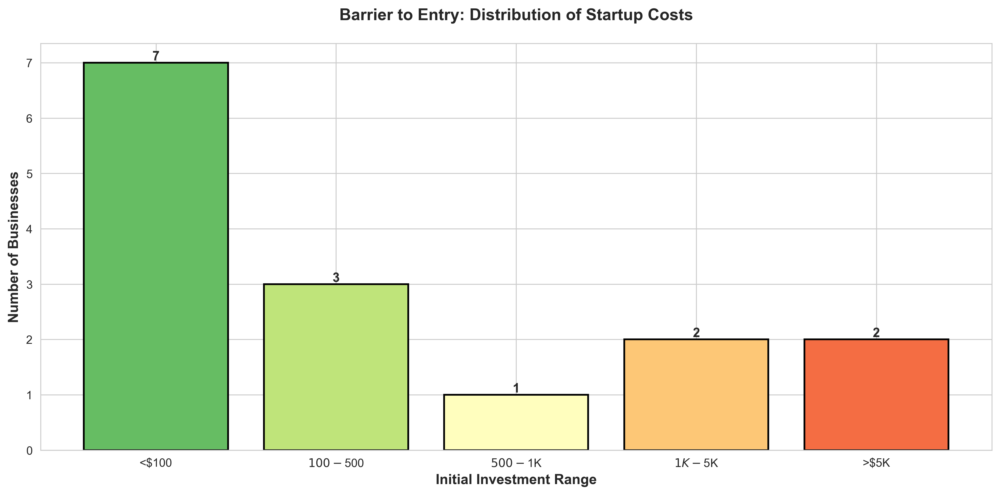
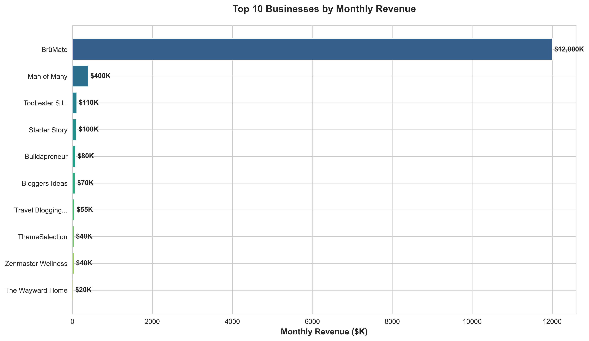
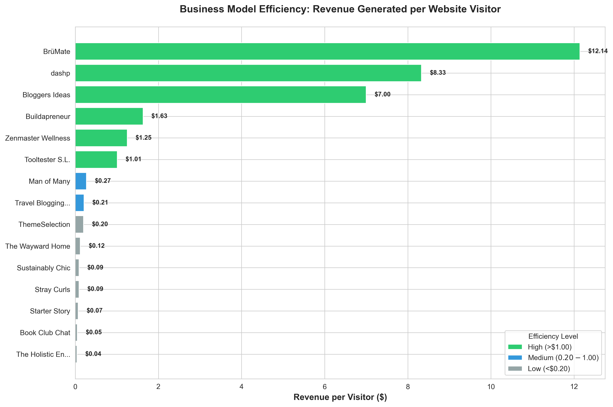
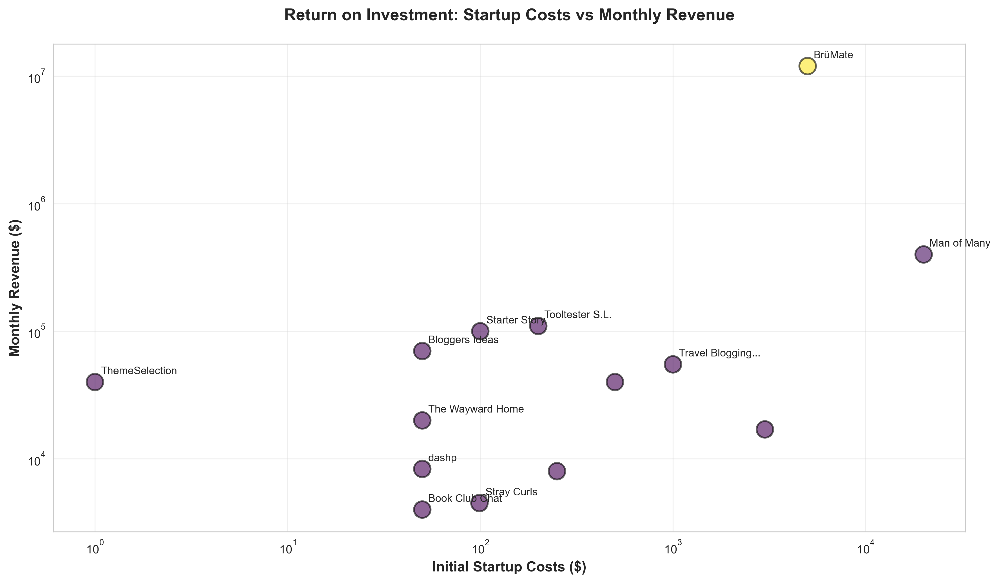
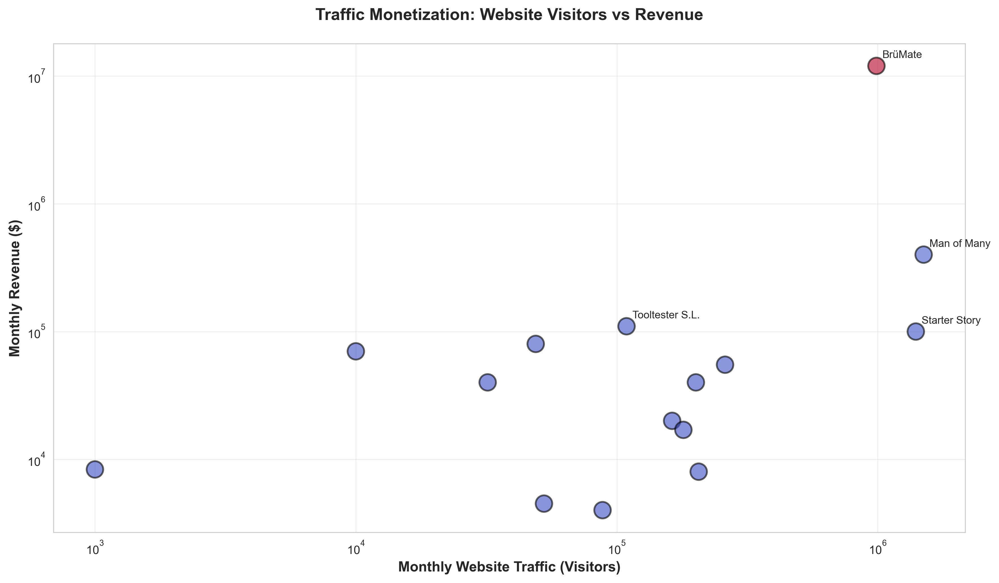
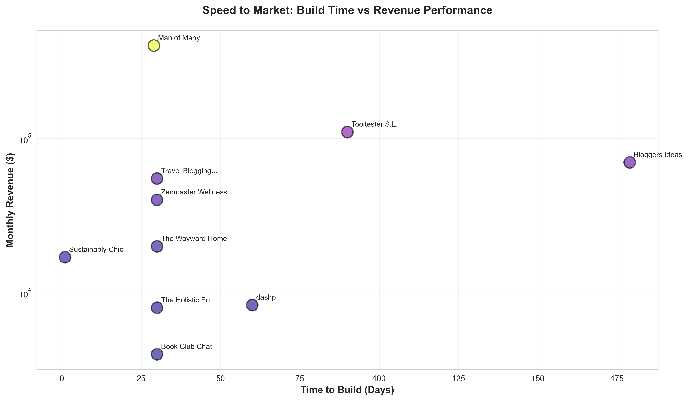
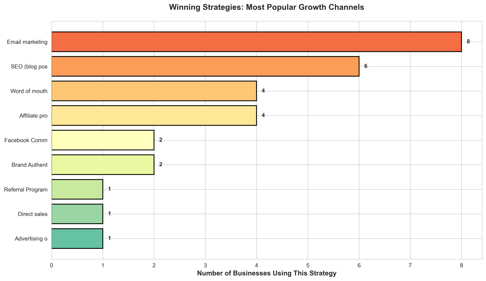
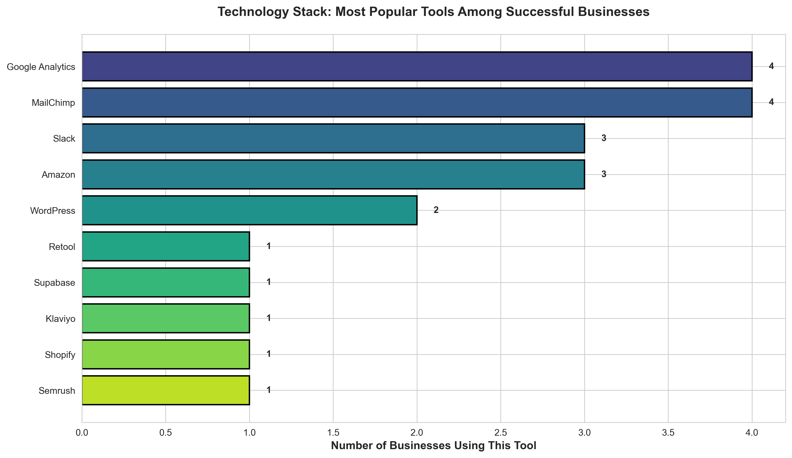
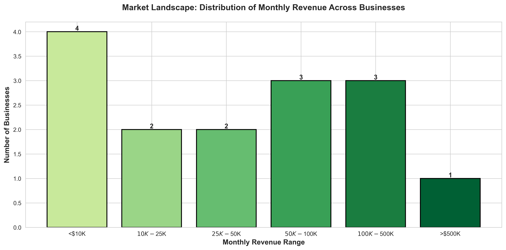
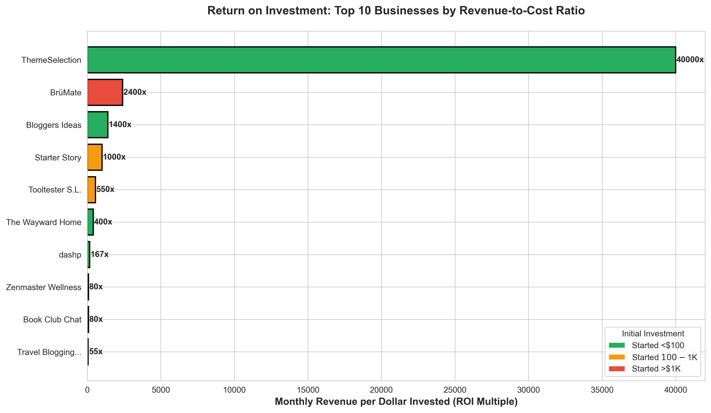

# Startup Success Analysis: Business Insights Report

## Executive Summary

This analysis examines 16 successful online businesses to uncover patterns, strategies, and opportunities for aspiring entrepreneurs. The businesses analyzed range from small niche blogs generating $4,000/month to major e-commerce brands earning $12 million monthly. Our findings reveal actionable insights about startup costs, revenue potential, growth strategies, and business model efficiency.

---

## Key Findings at a Glance

### The Opportunity is Real
- **87.5% of businesses** started with less than $1,000 in initial capital
- Average monthly revenue across all businesses: **$615,000**
- Top performer generates **$12M/month** (BrüMate)
- Lowest barrier to entry: **$0-$100** (multiple businesses)

### ROI Potential is Extraordinary
- Best ROI: **1,000x monthly return** (Starter Story: $100 → $100K/month)
- Content-based businesses show **2-1,000x monthly ROI multiples**
- Physical products require higher capital but achieve massive scale

---

## Critical Business Insights

### 1. Low Capital, High Returns: The Startup Cost Reality

**What This Shows:**
The majority of successful businesses (10 out of 16) launched with less than $500. Only one business required more than $5,000 to start.

**Why This Matters:**
The barrier to entry for building a profitable online business is remarkably low. Aspiring entrepreneurs don't need significant capital to start—they need the right idea, execution, and persistence.

**Strategic Implications:**
- Risk is minimal for bootstrapped ventures
- Capital constraints should not prevent business launch
- Focus should be on validating ideas quickly with minimal investment
- Budget allocation: domain, hosting, and basic tools ($50-500) is sufficient

---

### 2. Revenue Leaders: Who's Winning and Why

**What This Shows:**
The top 3 revenue generators are BrüMate ($12M/month), Man of Many ($400K/month), and Tooltester ($110K/month). A significant gap exists between the highest and lowest earners.

**Why This Matters:**
Different business models yield vastly different revenue scales. Physical products with mass appeal (BrüMate) can reach millions in monthly revenue, while niche content businesses typically plateau at $4K-100K monthly.

**Strategic Implications:**
- E-commerce and physical products offer highest revenue ceiling
- Content/affiliate businesses offer excellent profit margins with lower capital
- Market selection determines revenue potential more than effort
- Scaling content businesses requires traffic volume or high-value conversions

---

### 3. Business Model Efficiency: Revenue Per Visitor Analysis

**What This Shows:**
BrüMate generates $12.14 per visitor, while some content sites earn only $0.04 per visitor. The efficiency gap is **300x between highest and lowest performers**.

**Why This Matters:**
Not all traffic is created equal. The monetization strategy and business model determine how much revenue each visitor generates. High-value products or services dramatically outperform ad-based or low-ticket affiliate models.

**Strategic Implications:**
- E-commerce converts traffic more efficiently than display ads
- Affiliate businesses need 10-100x more traffic to match product-based revenue
- Premium offerings (courses, software, physical products) maximize visitor value
- Choose business model based on traffic acquisition capability
- If traffic is expensive/hard to get, pursue high revenue-per-visitor models

---

### 4. The ROI Paradox: Investment vs Returns

**What This Shows:**
There is no positive correlation between initial investment and revenue success. Some businesses with $50 investments generate $100K/month, while others with $5,000 investments generate less.

**Why This Matters:**
Success is not about how much money you invest—it's about market fit, execution, and value creation. Higher initial capital does not guarantee better outcomes.

**Strategic Implications:**
- Don't wait to save more capital before starting
- Validate your idea with minimal investment first
- Skills and execution matter more than budget
- Reinvest profits to scale rather than over-investing upfront

---

### 5. Traffic Monetization: The Revenue-Traffic Relationship

**What This Shows:**
While there's a general positive correlation between traffic and revenue, the relationship is not linear. Some businesses with 50K monthly visitors earn $80K, while others with 200K visitors earn only $8K.

**Why This Matters:**
Raw traffic volume is less important than traffic quality and monetization strategy. A smaller, highly-targeted audience can be more valuable than massive unfocused traffic.

**Strategic Implications:**
- Don't obsess over vanity metrics (total traffic)
- Focus on attracting high-intent visitors
- Conversion optimization matters more than traffic growth
- Niche audiences with specific problems pay premium prices
- B2B and specialized audiences offer better monetization than general consumer traffic

---

### 6. Speed to Market: Build Time vs Success

**What This Shows:**
Businesses built in 1-30 days perform just as well as those built over 60-180 days. There is no correlation between build time and revenue success.

**Why This Matters:**
Perfectionism is the enemy of progress. Successful founders launch quickly, validate with real customers, and iterate based on feedback rather than spending months building in isolation.

**Strategic Implications:**
- Launch an MVP (Minimum Viable Product) in 30 days or less
- Don't wait for perfection—ship early and improve based on customer feedback
- Speed to market allows faster learning and iteration
- Time spent building without customer validation is wasted
- First-mover advantage matters less than execution quality

---

### 7. Proven Growth Strategies: What Actually Works

**What This Shows:**
Email marketing and SEO are the dominant growth channels among successful businesses. Direct sales, word-of-mouth, and affiliate programs also feature prominently.

**Why This Matters:**
Successful businesses don't rely on paid advertising or complex funnels. They build organic, sustainable growth engines through content, search visibility, and relationship-building with their audience.

**Strategic Implications:**
- **Invest heavily in SEO** from day one—it's the #1 long-term growth driver
- **Build an email list immediately**—it's an owned asset that platforms can't take away
- Word-of-mouth indicates product-market fit—build something people want to share
- Affiliate programs leverage other people's audiences for low-cost customer acquisition
- Paid advertising is notably absent—organic channels win for bootstrapped businesses

---

### 8. Technology Stack: Tools of Success

**What This Shows:**
Google Analytics, MailChimp, Amazon, Slack, and WordPress are the most commonly used tools among successful businesses.

**Why This Matters:**
You don't need expensive, complex tools to build a successful business. The winning stack is affordable, proven, and focuses on core needs: analytics, email marketing, content management, and collaboration.

**Strategic Implications:**
- Start with free/low-cost tools (WordPress, MailChimp free tiers)
- Invest in analytics early to make data-driven decisions
- Email marketing platforms are non-negotiable for most business models
- Amazon affiliate program remains a reliable monetization channel
- Avoid tool bloat—stick to essentials until revenue justifies upgrades

---

### 9. Market Landscape: Revenue Distribution

**What This Shows:**
Most businesses (56%) earn between $0-50K monthly. Only 19% break $100K/month, and just 6% exceed $500K monthly.

**Why This Matters:**
Realistic revenue expectations are crucial for planning. While million-dollar months are possible, the typical successful online business generates $10K-50K monthly—still an excellent outcome for a low-capital venture.

**Strategic Implications:**
- Set realistic revenue targets: $10K-50K/month is a strong outcome
- Breaking $100K/month requires either massive scale or high-value offerings
- Plan business expenses and personal finances around median outcomes, not outliers
- Most businesses will not become unicorns—but they can generate life-changing income
- Sustainable $20K-50K/month businesses can be more valuable than chasing $1M/month

---

### 10. Champion ROI Cases: Learning from the Best

**What This Shows:**
The top ROI performers include Starter Story (1,000x), Bloggers Ideas (1,400x), and Buildapreneur (high multiple). All started with minimal capital ($0-$100).

**Why This Matters:**
These exceptional returns demonstrate that knowledge-based and content businesses can generate extraordinary ROI with virtually no capital. The limiting factor is not money—it's expertise, execution, and persistence.

**Strategic Implications:**
- Content/education businesses offer the highest ROI potential
- Monetization strategies: affiliate marketing, sponsorships, courses, ads
- Personal expertise can be converted into income with minimal investment
- Building an audience is the core asset—monetization options follow
- Platform risk is real (Google, social media)—diversify traffic sources

---

## Strategic Recommendations for Aspiring Entrepreneurs

### 1. **Start Small, Start Now**
Don't wait for the perfect idea or more capital. Launch with $50-500 and validate your concept with real customers within 30 days.

### 2. **Choose Your Business Model Wisely**
- **High traffic capability?** → Ad-based or affiliate content business
- **Niche expertise?** → Courses, coaching, or SaaS
- **Product idea?** → E-commerce or physical products
- **Limited time?** → Affiliate or curated content

### 3. **Invest in SEO and Email from Day One**
These are the two most reliable, sustainable growth channels. Build for the long term, not quick wins.

### 4. **Focus on Revenue per Visitor, Not Just Traffic**
100K visitors at $0.05 each = $5,000. 10K visitors at $1 each = $10,000. Quality beats quantity.

### 5. **Launch Fast, Iterate Faster**
The businesses that win are those that ship quickly, learn from customers, and continuously improve. Perfection is the enemy of profit.

### 6. **Leverage Proven Tools**
Don't reinvent the wheel. WordPress, MailChimp, Google Analytics, and basic hosting cover 90% of what you need.

### 7. **Understand the Revenue Ceiling**
Content/affiliate businesses typically cap at $10K-100K/month. For higher revenue, consider products, software, or services.

---

## Conclusion

The data reveals a clear pattern: **successful online businesses are built on execution, not capital**. The majority of these businesses started with less than $500, yet generate life-changing income. The key differentiators are:

- **Speed to market** (launch in 30 days or less)
- **Organic growth focus** (SEO + Email Marketing)
- **Business model selection** (choose based on your strengths and resources)
- **Revenue efficiency** (maximize value per customer/visitor)
- **Persistence and iteration** (keep improving based on data)

Whether you're aiming for $5K/month in side income or $500K/month in revenue, the fundamental principles remain the same: start small, validate quickly, focus on sustainable organic growth, and continuously optimize your business model.

The opportunity is real. The barrier to entry is low. The returns can be extraordinary.

**The question is not whether you can succeed—it's when you'll start.**

---

## Appendix: Data Summary

- **Total Businesses Analyzed:** 16
- **Revenue Range:** $4,000 - $12,000,000/month
- **Startup Cost Range:** $0 - $20,000
- **Average Startup Cost:** $1,606
- **Median Startup Cost:** $150
- **Average Monthly Revenue:** $614,831
- **Median Monthly Revenue:** $47,500
- **Most Common Growth Strategy:** Email Marketing + SEO
- **Most Common Tools:** Google Analytics, MailChimp, WordPress

---

*This report is designed for business decision-makers and aspiring entrepreneurs. All charts and data are available in the `/charts` directory. To regenerate visualizations, run `python generate_charts.py`.*
